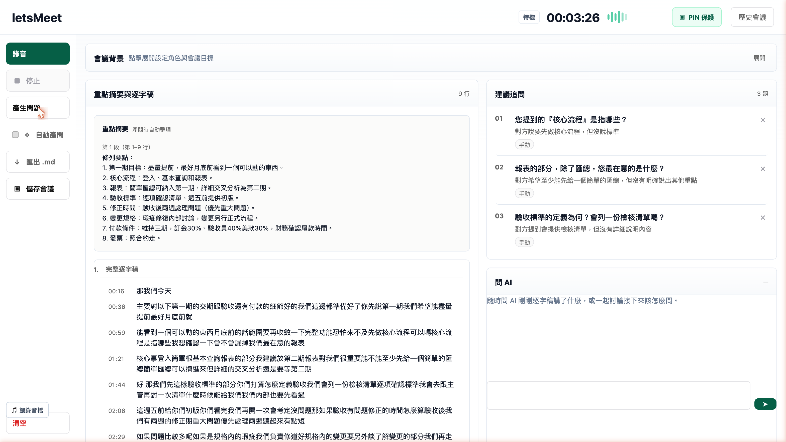
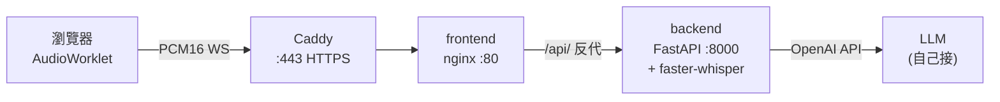

# letsMeet

**會議現場即時逐字稿 + AI 追問助手。**

開會時按錄音,你方聽到對方說的話會即時轉成逐字稿;按「產生問題」,AI 從你的視角生成 3-5 條你應該追問的問題,避免會議結束才想起來該問什麼。



> 單頁 cockpit 的**實際運行畫面**:左側錄音控制,中間「重點摘要 + 完整逐字稿」(此例為一段 3 分鐘的合約洽談,自動整理成 8 點摘要、帶時間戳的完整逐字稿),右側「建議追問」是按「產生問題」後 AI 從你的視角產出的 3 題(核心流程、報表重點、驗收標準),下方為即時問 AI。最右側可滑出歷史會議,受 PIN 保護的會議在清單上以鎖標示,需輸入 4 位數才能展開內容。

---

## 特色

- **即時逐字稿**:WebSocket 串流 PCM16 音訊,faster-whisper 在 server 端轉錄並即時推回前端
- **AI 追問**:把累積逐字稿丟給任何 OpenAI-compatible LLM(預設接內網自架 Breeze2,可換 OpenAI/Ollama/LM Studio)
- **即時 Chat**:邊開會邊跟 AI 來回對談 — 問「對方剛剛對交期怎麼說」、討論「接下來該追問什麼」,回覆 SSE streaming 逐字浮現,對話只存前端記憶體
- **重點摘要折疊**:每次產問順手把該批新發言壓成條列重點,主畫面只看摘要、原文預設折疊,需要核對時再展開
- **會議記錄持久化**:開完會把標題、重點摘要、完整逐字稿、產出的追問存進 SQLite,之後在「歷史會議」清單翻閱、展開重看(無登入,用填寫者標記歸屬)
- **PIN 保護**:存會議時可設 4 位數 PIN;清單只回 `is_protected` 旗標不外洩內容,要看詳情得帶對 PIN(缺/錯一律 401),由建立者自行設定(內網 demo,明碼存)
- **產問去重**:把畫面上已有的問題一併餵給 LLM,叫它別重複或產出意思相近的題目,寧可少問也不灌水
- **增量聚焦**:游標只把「上次產問後的新發言」送 LLM,舊內容轉成背景摘要,問題緊扣對話最新部分
- **雙欄脈絡**:「我的角色與重點」+「會議資訊」兩欄,引導 AI 站在你的視角提問
- **錄音匯出 WAV**:停止錄音時把整場音訊打包成標準 WAV 下載,留存原始錄音
- **滑動視窗摘要**:超過 6000 字會議自動摘要前段,保留最近 4000 字原文給 LLM
- **零 build step 前端**:純 vanilla HTML/JS,沒有 React/Vue/Webpack,改 CSS 直接 reload
- **三件套 docker-compose**:backend(FastAPI) + frontend(nginx) + caddy(HTTPS)

---

## 架構



| 元件 | 技術 | 角色 |
|---|---|---|
| `frontend/` | nginx + vanilla JS + AudioWorklet | 收音、顯示逐字稿、產問題 UI |
| `backend/` | FastAPI + faster-whisper | WS 轉錄 / `/api/questions`、`/api/digest`、`/api/chat`(SSE)LLM 橋接 |
| `caddy/` | Caddy v2 | HTTPS 反代(secure context 麥克風才開) |

---

## Quick Start

### 1. 你需要

- Docker 24+ / Docker Compose v2
- 一個 OpenAI-compatible LLM endpoint(自己有就用,沒有可以接 [Ollama](https://ollama.com) / [LM Studio](https://lmstudio.ai) 本機跑)
- 麥克風

### 2. 設環境

複製 `.env.example` → `.env`,改成你的 LLM endpoint:

```bash
cp .env.example .env
# 編輯 .env:
#   LLM_BASE_URL=http://你的-llm:8001/v1
#   LLM_MODEL=你的模型名
```

### 3. 起服務

```bash
docker compose up -d --build
```

首次 build 會花 5-15 分鐘(預載 Whisper ASR 模型 `phate334/Breeze-ASR-25-ct2`)。

### 4. 開頁面

| 用途 | URL |
|---|---|
| HTTPS(推薦,麥克風才會開) | `https://localhost:8444` |
| HTTP(只能看畫面,錄音會失敗) | `http://localhost:8082` |

> **為什麼一定要 HTTPS?** 瀏覽器規定 `AudioWorklet` 跟 `getUserMedia` 只在 secure context 給用 — HTTPS 或 `localhost` 都算。

預設 Caddy 用 `tls internal` 自簽憑證,Chrome 第一次會跳警告,按「進階 → 繼續前往」即可(內網 demo 用)。

---

## API

### `WS /api/stream`

前端透過 AudioWorklet 把 PCM16 LE / 16kHz / mono 切成 30ms 一包送上來。

Server 回:
- `{"type":"connected"}` — 連線成功
- `{"type":"processing"}` — 收到一段音訊,送 ASR 中
- `{"type":"transcription","text":"..."}` — 一段逐字稿
- `{"type":"error","message":"..."}` — 錯誤

### `POST /api/questions`

```json
{
  "transcript": "要聚焦提問的逐字稿(增量模式＝上次產問後的新行)",
  "prior_summary": "(可選) 上次回傳的 summary,讓 server 跳過摘要",
  "older_transcript": "(可選) 游標前已問過的舊原文;無 prior_summary 時由 server 摘要成背景並回傳",
  "context": "(可選) 你的角色與重點＋會議資訊,引導 AI 提問方向",
  "asked_questions": ["(可選) 畫面上已有的問題清單,讓 AI 避免重複或近似"]
}
```

回應:

```json
{
  "questions": [
    {"q": "驗收標準是?", "why": "對方未說明"},
    {"q": "誰能拍板?",   "why": "對方說『回去問』"}
  ],
  "summary": "(可選) 滑動視窗摘要,前端 cache 後回傳",
  "truncated": false
}
```

錯誤碼:
- `422` — transcript 為空
- `502` — LLM 回非 JSON / HTTP 錯誤
- `504` — LLM 超時

每個 response 都帶 `X-Request-Id` header 方便 trace。

### `POST /api/digest`

把一批逐字稿壓成條列重點(產問時前端自動呼叫,只整理「本批新發言」)。

```json
{ "transcript": "要整理成重點的逐字稿" }
```

回應:

```json
{ "summary": "- 甲方要求交期提前到月底\n- 驗收標準尚未敲定" }
```

錯誤碼:`422`(transcript 為空)/ `502`(LLM HTTP 錯誤)/ `504`(LLM 超時)。

### `POST /api/chat`

跟 AI 即時對談。**SSE streaming** 回覆,逐 token 吐。對話歷史由前端帶(存記憶體),逐字稿 / 會議背景 / 已產問當脈絡注入。

```json
{
  "messages": [{"role": "user", "content": "對方對交期是怎麼說的?"}],
  "transcript": "(可選) 逐字稿脈絡",
  "context": "(可選) 你的角色與重點＋會議資訊",
  "asked_questions": ["(可選) 已產出的問題清單"]
}
```

回應為 `text/event-stream`,逐片:

```
data: {"delta": "對方"}

data: {"delta": "說月底"}

data: [DONE]
```

`422`:messages 為空或內容全空白。連線建立後的上游錯誤(超時 / HTTP)走 `data: {"error":"..."}` 事件而非 HTTP code。

### `POST /api/meetings`

存一場會議記錄(摘要＋逐字稿＋追問)。

```json
{
  "title": "與甲方交期會議",
  "owner": "YC",
  "context": "(可選) 角色＋會議資訊",
  "summary": "(可選) 重點摘要",
  "transcript": "(可選) 完整原始逐字稿",
  "questions": [{"q": "驗收標準?", "why": "未說明"}],
  "pin_code": "(可選) 4 位數字 PIN;設了之後讀詳情需帶對 PIN"
}
```

回應:`{"id": 1}`。`422`:title 或 owner 為空,或 `pin_code` 非 4 位數字。

### `GET /api/meetings`

歷史會議列表(輕量欄位,依時間新到舊)。可選 `?owner=YC` 篩選歸屬。**不外洩 `pin_code`**,只回 `is_protected` 旗標標示是否上鎖。

```json
{ "meetings": [{"id": 1, "title": "與甲方交期會議", "owner": "YC", "created_at": "2026-05-28T...", "is_protected": true}] }
```

### `GET /api/meetings/{id}`

單場會議完整內容(摘要＋逐字稿＋追問)。受保護的會議需帶 `?pin=1234`。回應**不含 `pin_code`**。

- `404`:找不到該場會議
- `401`:會議受保護,但未提供或 PIN 錯誤 → `{"error": "PIN 錯誤或未提供", "pin_required": true}`

```json
{
  "id": 1, "title": "與甲方交期會議", "owner": "YC",
  "context": "...", "created_at": "2026-05-28T...",
  "summary": "- 重點一\n- 重點二", "transcript": "完整逐字稿",
  "questions": [{"q": "驗收標準?", "why": "未說明"}]
}
```

### `GET /api/health`

```json
{"status":"ok","backend":"faster-whisper","model":"phate334/Breeze-ASR-25-ct2"}
```

---

## 設定

`docker-compose.yml` / `.env` 可調:

| Env | 預設 | 說明 |
|---|---|---|
| `STREAM_MODEL` | `phate334/Breeze-ASR-25-ct2` | ASR 模型(HuggingFace ID) |
| `DEVICE` | `cpu` | `cpu` / `cuda` / `auto` |
| `COMPUTE_TYPE` | `int8` | `int8`(CPU)/ `float16`(GPU) |
| `ASR_BACKEND` | `faster-whisper` | `faster-whisper` / `transformers` |
| `MAX_CONNECTIONS` | `20` | 同時 WS 連線上限 |
| `LLM_BASE_URL` | `http://10.1.1.7:31367/v1` | OpenAI-compatible endpoint |
| `LLM_MODEL` | `MediaTek-Research/Llama-Breeze2-8B-Instruct` | 模型名 |
| `LLM_TEMPERATURE` | `0.2` | LLM 溫度 |
| `LLM_MAX_TOKENS` | `1024` | LLM 最大輸出 |
| `LETSMEET_DB_PATH` | `/data/letsmeet.db` | SQLite 會議記錄路徑(docker volume) |

---

## 開發

### Backend

```bash
cd backend
python -m venv .venv && source .venv/bin/activate
pip install -r requirements.txt
LLM_BASE_URL=http://你的-llm:8001/v1 \
  uvicorn app.main:app --host 0.0.0.0 --port 8000 --reload
```

### Frontend

純 vanilla,沒 build step。改 `frontend/assets/*.js` / `*.css` 直接 reload 瀏覽器即可。

```bash
cd frontend
python -m http.server 8082
# 開 http://localhost:8082(僅當 backend 跑在同 8000 port 時可用)
```

### 測試

```bash
cd backend && pytest --cov=app --cov-report=term-missing -q
```

目前 94 passed、~90% 覆蓋率。需要真 ASR 模型的路徑標 `# pragma: no cover`,屬 integration smoke。

---

## 為什麼自己寫一個

市面上 Otter / tl;dv / Read.ai 都是把音訊送到雲端、訂閱制、會議結束才看到摘要。letsMeet:

1. **完全本地**:音訊不離開你的內網
2. **會議中就有 AI 追問**:不是事後摘要,是讓你**現場**問出對的問題
3. **接你自己的 LLM**:Breeze2 / Llama / GPT-4 / 任何 OpenAI-compatible 都行
4. **不到 1000 行 code**:前端 + 後端加起來,改起來不痛
